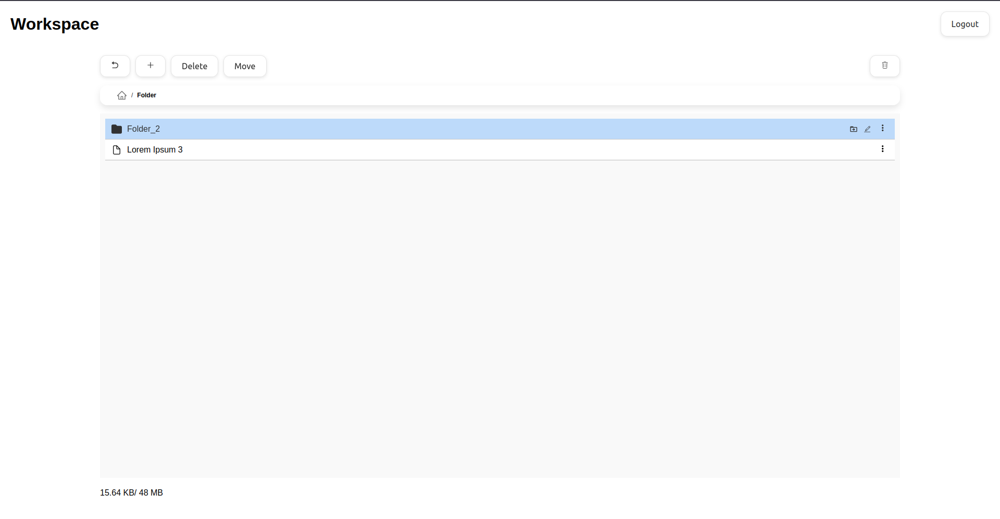
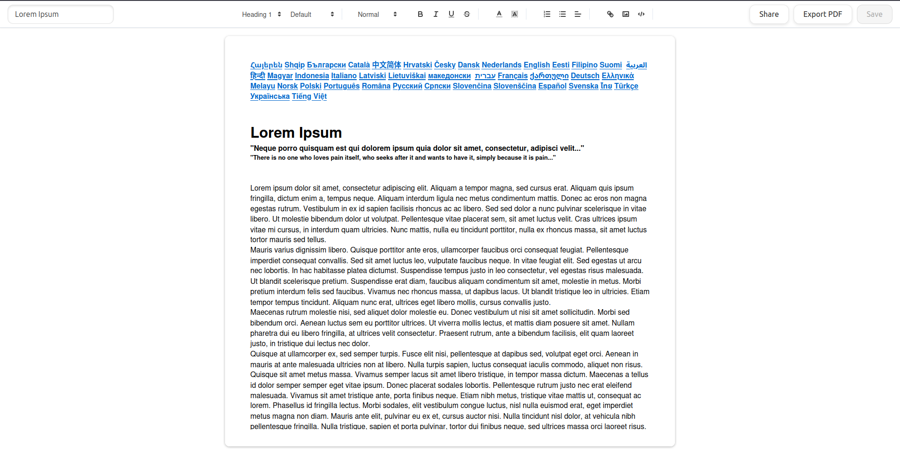

# DocFlow

A modern web application for efficient document management.

## Overview

DocFlow is a feature-rich document management system built with React TypeScript and Flask, providing an intuitive interface for organizing and editing text documents.

## Key Features

### Advanced File Management
- Hierarchical file organization with folders and subfolders
- Drag-and-drop functionality for easy document reorganization
- Rename, move, and delete operations
- Intuitive navigation through document structures

### Document Editor
- Based on React Quill with custom enhancements
- Rich text formatting capabilities
- Clean and distraction-free interface

### Collaborative Features
- Document sharing via unique links
- Configurable access levels (Editor/Viewer modes)

## Screenshots

### File Manager

### Document Editor

## Tech Stack

- Frontend: React with TypeScript
- Backend: Flask (Python)
- Database: MySQL

